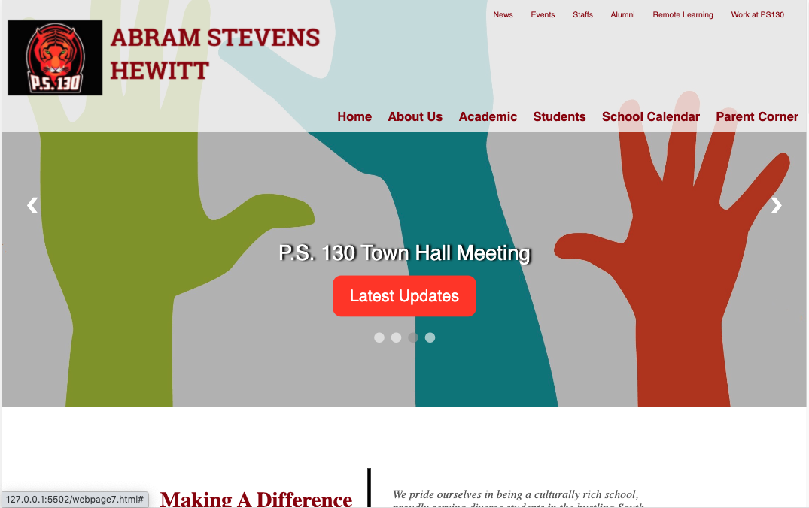
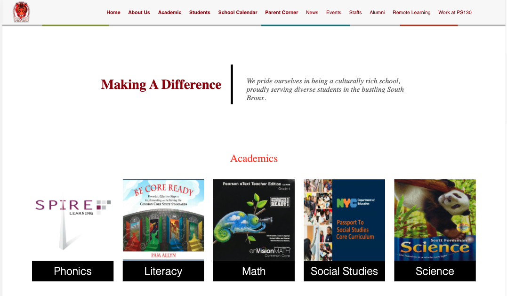
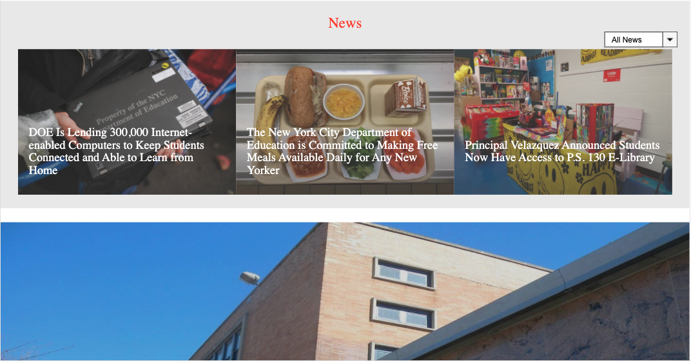
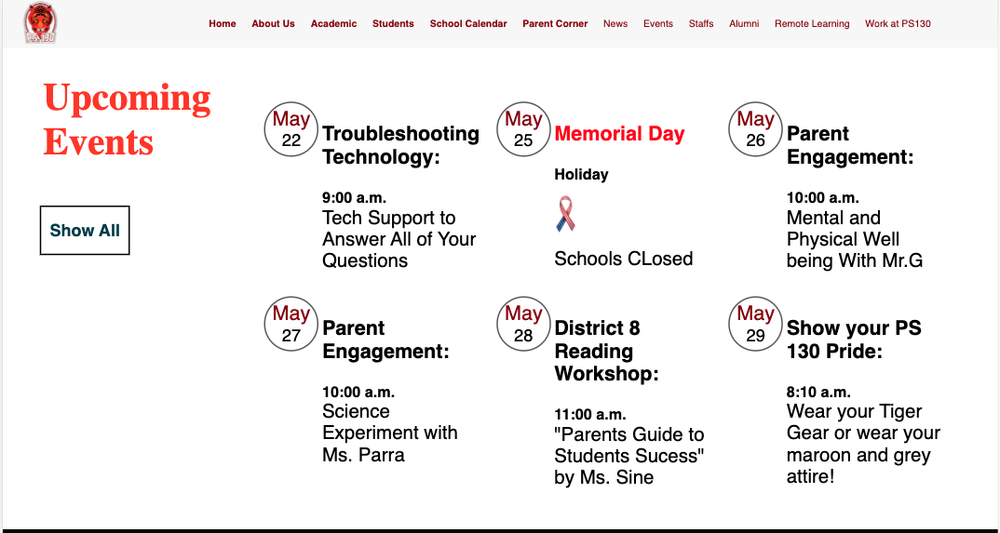

# Abram Stevens Hewitt

## Description

This is a one page web application project which contains an unique visual design compare to the website the school uses (ps130x.com). Users have access to the slideshow on the main page to choose the latest updates on the school. Abram Stevens Hewitt webpage shows academic subjects taught in the school, for exmaple, Phonics, Literacy, Math, Social Studies, and Science. There is a news section where users can read the latest news in the school. A calendar was added at the bottom of the page where users can see upcoming events. The calendar must be updated via html file. The application is responsive to desktop, tablet and mobile device.

## User Interface

### Homepage is divided into three sections: School updates, Academics, News, and Calendar.

- The carousel can be used to add collection of updates on the school's main events, or articles.
- The academic section contains 5 boxes where it can be potentially use for redirecting users to a separate page containing content related to the subject.
- News section has a slide show effect showcasing recent news on the schools activities.
- Calendar will remind users about the events that is coming up. This section can be updated by going back to the html file and changing the content.

## Requirements:

- Abram Stevens Hewitt application was developed using HTML, CSS and Javascript.
- Flexbox was utilized to lay out the content neatly and efficiently on the web application
- This web page is responsive on three different screen sizes: desktop, mobile, and tablet. Application will be hosted on Github.

## Inspiration 

Working as a teacher assistant at PS 130, the assistant principal introduced a basic website using Wix.com. After analyzing the design of the webpage, I believe an unique design, similiar to the design used by the Ivy league schools' website, could be added to this webpage. Using Columbia's, Princeton's, and Brown's website as inpiration, I created a single webpage to enhace the design used in wix.com.

##### Disclaimer: I do not own the rights to any of the images included in this respository. All images were pulled from Google searches.